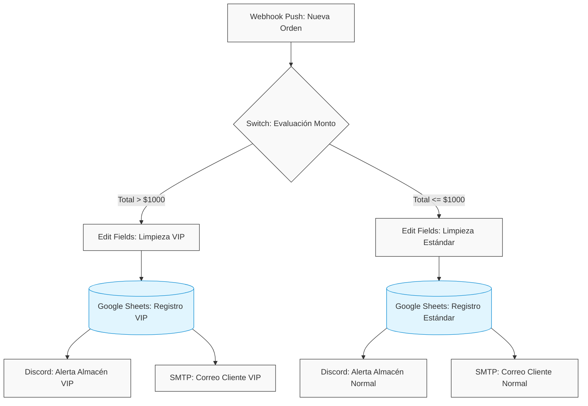

# n8n E-commerce Order Router

[](https://n8n.io/)
[](https://www.docker.com/)
[](https://developers.google.com/sheets/api)
[](https://oauth.net/2/)

Sistema middleware de automatización desarrollado para la gestión, procesamiento y enrutamiento en tiempo real de órdenes de comercio electrónico. La arquitectura implementa un patrón de diseño orientado a eventos y distribución multicanal (Fan-out), operando de forma autónoma en un entorno de contenedores.

## Descripción del Proyecto

Este sistema actúa como un orquestador central entre una tienda en línea y los departamentos operativos de una empresa. Elimina la captura manual de datos "escuchando" pasivamente las transacciones exitosas, evaluando la prioridad de la compra mediante reglas de negocio, y distribuyendo la información limpia hacia bases de datos de registro, canales de logística y comunicación directa con el cliente final.

## Stack Tecnológico

| Componente | Tecnología / Herramienta | Propósito |
| :--- | :--- | :--- |
| **Orquestador** | n8n | Motor de flujos de trabajo basado en nodos (Fair-code). |
| **Infraestructura** | Docker / Docker Compose | Despliegue estandarizado y persistencia de volúmenes. |
| **Ingesta de Datos** | HTTP Webhook | Recepción pasiva de payloads JSON (Push Events). |
| **Almacenamiento** | Google Sheets API | Persistencia de datos históricos y CRM ligero. |
| **Seguridad** | Google Cloud Console | Autenticación y autorización mediante OAuth2. |
| **Notificaciones** | Discord Webhooks / SMTP | Alertas operativas internas y confirmaciones externas. |

## Arquitectura y Flujo de Operación

El flujo de procesamiento sigue una estructura no lineal, bifurcando los datos en función del valor total de la orden transaccionada.



## Estructura del Repositorio

```text
n8n-ecommerce-router/
├── .gitignore                  # Reglas de exclusión de datos sensibles
├── docker-compose.yml          # Definición de la infraestructura
├── README.md                   # Documentación técnica
└── workflows/
    └── router_ecommerce.json   # Código fuente del flujo de automatización exportado

```

## Documentación de Despliegue

Sigue estos pasos para replicar el entorno de ejecución en una instancia local o servidor remoto.

### 1. Levantar la Infraestructura

Ejecuta el siguiente comando en la raíz del proyecto para descargar la imagen oficial y levantar el contenedor en segundo plano:

```bash
docker compose up -d

```

La interfaz de administración estará disponible en `http://localhost:5678`.

### 2. Importar el Flujo de Trabajo

1. Accede a la interfaz de n8n.
2. En el panel principal, dirígete a la sección superior derecha, haz clic en el menú contextual `...` y selecciona **Import from File**.
3. Selecciona el archivo `workflows/router_ecommerce.json`.

> [!NOTE]
> Al importar el flujo, los nodos que requieren autenticación externa aparecerán con advertencias. Es necesario configurar las credenciales locales para que el sistema opere correctamente.

---

## Guía de Configuración Local (Variables a Modificar)

El archivo `router_ecommerce.json` ha sido saneado para su distribución pública. Para que el proyecto funcione en tu entorno, debes reemplazar los siguientes identificadores por tus valores reales directamente en la interfaz de n8n.

> [!IMPORTANT]
> No modifiques el archivo `.json` en tu editor de código para agregar credenciales reales, ya que Git registrará estos cambios. Realiza todas las configuraciones exclusivamente a través de la interfaz gráfica de n8n.

### Configuración de Nodos

| Nodo (Nombre en n8n) | Propiedad a Modificar | Identificador Público a Reemplazar |
| --- | --- | --- |
| **Trigger - Recibir Orden** | `Webhook URL` | (Generado automáticamente al activar el entorno de pruebas o producción). |
| **Sheets - Registrar VIP** | `Document ID` | `ID_DEL_DOCUMENTO_OCULTO` |
| **Sheets - Registrar VIP** | `Sheet ID / URL` | `URL_DEL_DOCUMENTO_OCULTA` |
| **Sheets - Registrar Estandar** | `Document ID` | `ID_DEL_DOCUMENTO_OCULTO` |
| **Sheets - Registrar Estandar** | `Sheet ID / URL` | `URL_DEL_DOCUMENTO_OCULTA` |
| **Notificar - Almacen VIP** | `Webhook URL` | Configurar en ventana de credenciales de Discord. |
| **Notificar - Almacen Estandar** | `Webhook URL` | Configurar en ventana de credenciales de Discord. |
| **Email - Recibo Cliente VIP** | `From Email` | `CORREO_REMITENTE_AQUI` |
| **Email - Recibo Cliente** | `From Email` | `CORREO_REMITENTE_AQUI` |

### Gestión de Credenciales de Seguridad

Deberás crear tres conjuntos de credenciales en tu instancia local de n8n (Menú izquierdo > *Credentials*):

1. **Google Sheets API (OAuth2):** Requiere configuración previa en Google Cloud Console para obtener `Client ID` y `Client Secret`.
2. **Discord Webhook API:** Requiere la URL directa del canal generada desde la configuración del servidor de Discord.
3. **SMTP Account:** Requiere las credenciales del servidor de correo saliente. Si utilizas Gmail, emplea una **Contraseña de Aplicación**, no tu contraseña principal.

> [!WARNING]
> Seguridad de Repositorio: Asegúrate de que el directorio `n8n_data/` y cualquier archivo `.env` estén incluidos en tu archivo `.gitignore` antes de realizar un `git push`. La base de datos local de n8n contiene tus tokens de acceso encriptados.

---

*Desarrollado por JuanEnC.*
